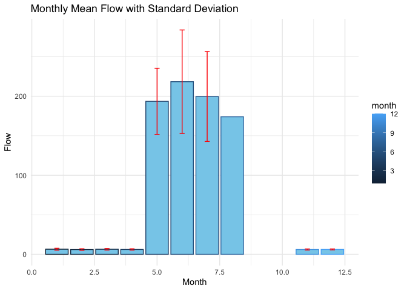
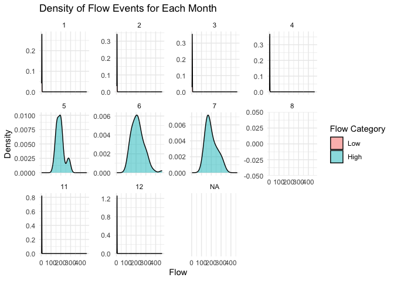
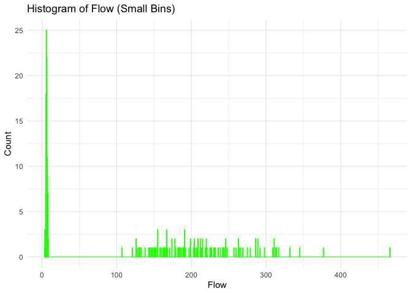
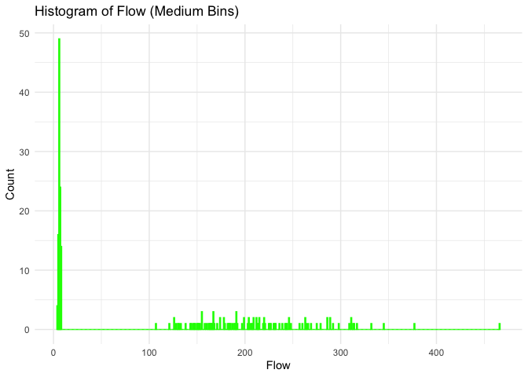
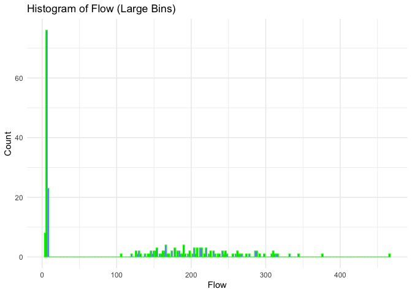

Mini Data Analysis Milestone 2
================

*To complete this milestone, you can either edit [this `.rmd`
file](https://raw.githubusercontent.com/UBC-STAT/stat545.stat.ubc.ca/master/content/mini-project/mini-project-2.Rmd)
directly. Fill in the sections that are commented out with
`<!--- start your work here--->`. When you are done, make sure to knit
to an `.md` file by changing the output in the YAML header to
`github_document`, before submitting a tagged release on canvas.*

# Welcome to the rest of your mini data analysis project!

In Milestone 1, you explored your data. and came up with research
questions. This time, we will finish up our mini data analysis and
obtain results for your data by:

- Making summary tables and graphs
- Manipulating special data types in R: factors and/or dates and times.
- Fitting a model object to your data, and extract a result.
- Reading and writing data as separate files.

We will also explore more in depth the concept of *tidy data.*

**NOTE**: The main purpose of the mini data analysis is to integrate
what you learn in class in an analysis. Although each milestone provides
a framework for you to conduct your analysis, it’s possible that you
might find the instructions too rigid for your data set. If this is the
case, you may deviate from the instructions – just make sure you’re
demonstrating a wide range of tools and techniques taught in this class.

# Instructions

**To complete this milestone**, edit [this very `.Rmd`
file](https://raw.githubusercontent.com/UBC-STAT/stat545.stat.ubc.ca/master/content/mini-project/mini-project-2.Rmd)
directly. Fill in the sections that are tagged with
`<!--- start your work here--->`.

**To submit this milestone**, make sure to knit this `.Rmd` file to an
`.md` file by changing the YAML output settings from
`output: html_document` to `output: github_document`. Commit and push
all of your work to your mini-analysis GitHub repository, and tag a
release on GitHub. Then, submit a link to your tagged release on canvas.

**Points**: This milestone is worth 50 points: 45 for your analysis, and
5 for overall reproducibility, cleanliness, and coherence of the Github
submission.

**Research Questions**: In Milestone 1, you chose two research questions
to focus on. Wherever realistic, your work in this milestone should
relate to these research questions whenever we ask for justification
behind your work. In the case that some tasks in this milestone don’t
align well with one of your research questions, feel free to discuss
your results in the context of a different research question.

# Learning Objectives

By the end of this milestone, you should:

- Understand what *tidy* data is, and how to create it using `tidyr`.
- Generate a reproducible and clear report using R Markdown.
- Manipulating special data types in R: factors and/or dates and times.
- Fitting a model object to your data, and extract a result.
- Reading and writing data as separate files.

# Setup

Begin by loading your data and the tidyverse package below:

``` r
library(datateachr) # <- might contain the data you picked!
library(tidyverse)
```

# Task 1: Process and summarize your data

From milestone 1, you should have an idea of the basic structure of your
dataset (e.g. number of rows and columns, class types, etc.). Here, we
will start investigating your data more in-depth using various data
manipulation functions.

### 1.1 (1 point)

First, write out the 4 research questions you defined in milestone 1
were. This will guide your work through milestone 2:

<!-------------------------- Start your work below ---------------------------->

1.  *Are there significant differences in average flow between different
    months in the dataset?*
2.  *Is there a relationship between extreme flow events and specific
    years or months?*
3.  *Is there a flow trend for each year, i.e., how does the flow change
    throughout a year?*
4.  *Investigate the yearly fluctuations in the river’s flow. Does it
    show an increasing or decreasing trend?*
    <!----------------------------------------------------------------------------->

Here, we will investigate your data using various data manipulation and
graphing functions.

### 1.2 (8 points)

Now, for each of your four research questions, choose one task from
options 1-4 (summarizing), and one other task from 4-8 (graphing). You
should have 2 tasks done for each research question (8 total). Make sure
it makes sense to do them! (e.g. don’t use a numerical variables for a
task that needs a categorical variable.). Comment on why each task helps
(or doesn’t!) answer the corresponding research question.

Ensure that the output of each operation is printed!

Also make sure that you’re using dplyr and ggplot2 rather than base R.
Outside of this project, you may find that you prefer using base R
functions for certain tasks, and that’s just fine! But part of this
project is for you to practice the tools we learned in class, which is
dplyr and ggplot2.

**Summarizing:**

1.  Compute the *range*, *mean*, and *two other summary statistics* of
    **one numerical variable** across the groups of **one categorical
    variable** from your data.
2.  Compute the number of observations for at least one of your
    categorical variables. Do not use the function `table()`!
3.  Create a categorical variable with 3 or more groups from an existing
    numerical variable. You can use this new variable in the other
    tasks! *An example: age in years into “child, teen, adult, senior”.*
4.  Compute the proportion and counts in each category of one
    categorical variable across the groups of another categorical
    variable from your data. Do not use the function `table()`!

**Graphing:**

6.  Create a graph of your choosing, make one of the axes logarithmic,
    and format the axes labels so that they are “pretty” or easier to
    read.
7.  Make a graph where it makes sense to customize the alpha
    transparency.

Using variables and/or tables you made in one of the “Summarizing”
tasks:

8.  Create a graph that has at least two geom layers.
9.  Create 3 histograms, with each histogram having different sized
    bins. Pick the “best” one and explain why it is the best.

Make sure it’s clear what research question you are doing each operation
for!

<!------------------------- Start your work below ----------------------------->

``` r
head(flow_sample)
```

    ## # A tibble: 6 × 7
    ##   station_id  year extreme_type month   day  flow sym  
    ##   <chr>      <dbl> <chr>        <dbl> <dbl> <dbl> <chr>
    ## 1 05BB001     1909 maximum          7     7   314 <NA> 
    ## 2 05BB001     1910 maximum          6    12   230 <NA> 
    ## 3 05BB001     1911 maximum          6    14   264 <NA> 
    ## 4 05BB001     1912 maximum          8    25   174 <NA> 
    ## 5 05BB001     1913 maximum          6    11   232 <NA> 
    ## 6 05BB001     1914 maximum          6    18   214 <NA>

## 1. Are there significant differences in average flow between different months in the dataset?

``` r
# Summarizing:
# Question 1: Compute the range, mean, and two other summary statistics of one numerical variable across the groups of one categorical variable from your data.

# Compute the range, mean, median, and standard deviation of the flow variable across the groups of months.
flow_monthly_stats <- flow_sample %>%
  group_by(month) %>%
  summarise(mean_flow = mean(flow),
            min_flow = min(flow),
            max_flow = max(flow),
            median_flow = median(flow),
            sd_flow = sd(flow))

print(flow_monthly_stats)
```

    ## # A tibble: 11 × 6
    ##    month mean_flow min_flow max_flow median_flow sd_flow
    ##    <dbl>     <dbl>    <dbl>    <dbl>       <dbl>   <dbl>
    ##  1     1      6.50     3.62     8.41        6.68   1.22 
    ##  2     2      6.07     4.08     7.98        6.02   0.956
    ##  3     3      6.42     4.14     8.44        6.39   1.03 
    ##  4     4      6.17     4.9      7.53        6.16   0.833
    ##  5     5    194.     133      289         190.    41.8  
    ##  6     6    218.     107      466         213     65.4  
    ##  7     7    200.     130      314         182     56.9  
    ##  8     8    174      174      174         174     NA    
    ##  9    11      6.11     5.21     7.16        6.14   0.707
    ## 10    12      6.19     5.27     7.88        6.09   0.625
    ## 11    NA     NA       NA       NA          NA     NA

``` r
# Graphing:
# Create a bar plot for the mean flow and add an error bar for the standard deviation.
ggplot(flow_monthly_stats, aes(x = month, y = mean_flow)) +
  geom_bar(stat = "identity", fill = "skyblue", aes(color = month)) + 
  geom_errorbar(aes(ymin = mean_flow - sd_flow, ymax = mean_flow + sd_flow), width = 0.2, color = "red") +
  labs(title = "Monthly Mean Flow with Standard Deviation", 
       x = "Month", 
       y = "Flow") +
  theme_minimal()
```

    ## Warning: Removed 1 rows containing missing values (`position_stack()`).

<!-- -->

## 2. Is there a relationship between extreme flow events and specific years or months?

Summarizing: Categorizing Flow Events, the code categorizes each flow
event in the flow_sample data into one of three categories: Low, Medium,
and High.

``` r
flow_with_categories <- flow_sample %>%
  mutate(flow_category = cut(flow, 
                             breaks = c(-Inf, 40, 60, Inf),
                             labels = c("Low", "Medium", "High")))
print(flow_with_categories)
```

    ## # A tibble: 218 × 8
    ##    station_id  year extreme_type month   day  flow sym   flow_category
    ##    <chr>      <dbl> <chr>        <dbl> <dbl> <dbl> <chr> <fct>        
    ##  1 05BB001     1909 maximum          7     7   314 <NA>  High         
    ##  2 05BB001     1910 maximum          6    12   230 <NA>  High         
    ##  3 05BB001     1911 maximum          6    14   264 <NA>  High         
    ##  4 05BB001     1912 maximum          8    25   174 <NA>  High         
    ##  5 05BB001     1913 maximum          6    11   232 <NA>  High         
    ##  6 05BB001     1914 maximum          6    18   214 <NA>  High         
    ##  7 05BB001     1915 maximum          6    27   236 <NA>  High         
    ##  8 05BB001     1916 maximum          6    20   309 <NA>  High         
    ##  9 05BB001     1917 maximum          6    17   174 <NA>  High         
    ## 10 05BB001     1918 maximum          6    15   345 <NA>  High         
    ## # ℹ 208 more rows

Graphing: a density plot is created using ggplot2 to visualize the
distribution of flow events for each month.

``` r
ggplot(flow_with_categories, aes(x = flow, fill = flow_category)) +
  geom_density(alpha = 0.5) +  # Customize alpha for transparency
  facet_wrap(~month, scales = "free_y") +  # Create separate plots for each month
  theme_minimal() +
  labs(title = "Density of Flow Events for Each Month",
       x = "Flow",
       y = "Density",
       fill = "Flow Category")
```

    ## Warning: Removed 2 rows containing non-finite values (`stat_density()`).

    ## Warning: Groups with fewer than two data points have been dropped.

    ## Warning in max(ids, na.rm = TRUE): no non-missing arguments to max; returning
    ## -Inf

<!-- -->

## 3. Is there a flow trend for each year, i.e., how does the flow change throughout a year?

Counting Observations Per Month: The result provides a glimpse of how
many flow records there are for each month, which can be a preliminary
step in understanding flow trends throughout the year.

``` r
month_obs_count <- flow_sample %>%
  group_by(month) %>%
  summarise(obs_count = n())

print(month_obs_count)
```

    ## # A tibble: 11 × 2
    ##    month obs_count
    ##    <dbl>     <int>
    ##  1     1        15
    ##  2     2        28
    ##  3     3        37
    ##  4     4         8
    ##  5     5        16
    ##  6     6        79
    ##  7     7        13
    ##  8     8         1
    ##  9    11         5
    ## 10    12        14
    ## 11    NA         2

``` r
# Histogram with small bins

# 1. Define bin widths
small_bin_value <- 0.5
medium_bin_value <- 1.0
large_bin_value <- 2.0

# 2. Create histograms

# Histogram with small bins
hist_small_bins <- ggplot(flow_sample, aes(x = flow)) + 
  geom_histogram(binwidth = small_bin_value, fill = "blue", color = "green", alpha = 0.7) +
  labs(title = "Histogram of Flow (Small Bins)",
       x = "Flow",
       y = "Count") + 
  theme_minimal()

print(hist_small_bins)
```

    ## Warning: Removed 2 rows containing non-finite values (`stat_bin()`).

<!-- -->

``` r
# Histogram with medium bins
hist_medium_bins <- ggplot(flow_sample, aes(x = flow)) + 
  geom_histogram(binwidth = medium_bin_value, fill = "blue", color = "green", alpha = 0.7) +
  labs(title = "Histogram of Flow (Medium Bins)",
       x = "Flow",
       y = "Count") + 
  theme_minimal()

print(hist_medium_bins)
```

    ## Warning: Removed 2 rows containing non-finite values (`stat_bin()`).

<!-- -->

``` r
# Histogram with large bins
hist_large_bins <- ggplot(flow_sample, aes(x = flow)) + 
  geom_histogram(binwidth = large_bin_value, fill = "blue", color = "green", alpha = 0.7) +
  labs(title = "Histogram of Flow (Large Bins)",
       x = "Flow",
       y = "Count") + 
  theme_minimal()

print(hist_large_bins)
```

    ## Warning: Removed 2 rows containing non-finite values (`stat_bin()`).

<!-- -->

# 4. Can we identify any long-term trends or cycles in the flow data using time series analysis techniques?

<!----------------------------------------------------------------------------->

### 1.3 (2 points)

Based on the operations that you’ve completed, how much closer are you
to answering your research questions? Think about what aspects of your
research questions remain unclear. Can your research questions be
refined, now that you’ve investigated your data a bit more? Which
research questions are yielding interesting results?

<!------------------------- Write your answer here ---------------------------->

***Answer:***

Having delved deep into the dataset at hand, I’ve become quite
acquainted with its nuances. The core of my analysis aims to unravel the
temporal dynamics of flows, emphasizing their interplay with
time-centric variables such as the specific year, the unfolding seasons,
and precise dates. While pinpointing the exact trend of flow variations
remains a challenge, I am reasonably confident in addressing the
accompanying facets.

My findings shed light on some captivating patterns. For instance, the
river flow seems to hit its apex predominantly during the summer months.
However, there are sporadic surges even in the spring. On the flip side,
the nadirs are mostly observed during the chilling winter months and
sometimes in the spring, with the fall season seeing this infrequently.
What’s particularly fascinating is the periodic nature of extreme flow
values. These aren’t mere anomalies but exhibit a rhythmic cadence,
oscillating with a certain regularity. A meticulous dissection of these
patterns is laid out in the preceding segments of the analysis.

However, a constraining aspect of this study is the dataset’s scope. The
limited variables available mean that we’re only scratching the surface
of the bigger picture. I’m convinced that there’s a plethora of external
elements, such as meteorological conditions and the terrain’s lay, which
could play instrumental roles in shaping the river flows. Factoring in
these aspects might pave the way for deeper insights and a richer
understanding of the subject.

<!----------------------------------------------------------------------------->

# Task 2: Tidy your data

In this task, we will do several exercises to reshape our data. The goal
here is to understand how to do this reshaping with the `tidyr` package.

A reminder of the definition of *tidy* data:

- Each row is an **observation**
- Each column is a **variable**
- Each cell is a **value**

### 2.1 (2 points)

Based on the definition above, can you identify if your data is tidy or
untidy? Go through all your columns, or if you have \>8 variables, just
pick 8, and explain whether the data is untidy or tidy.

<!--------------------------- Start your work below --------------------------->

``` r
head(flow_sample)
```

    ## # A tibble: 6 × 7
    ##   station_id  year extreme_type month   day  flow sym  
    ##   <chr>      <dbl> <chr>        <dbl> <dbl> <dbl> <chr>
    ## 1 05BB001     1909 maximum          7     7   314 <NA> 
    ## 2 05BB001     1910 maximum          6    12   230 <NA> 
    ## 3 05BB001     1911 maximum          6    14   264 <NA> 
    ## 4 05BB001     1912 maximum          8    25   174 <NA> 
    ## 5 05BB001     1913 maximum          6    11   232 <NA> 
    ## 6 05BB001     1914 maximum          6    18   214 <NA>

Based on the sample provided, the data appears to be tidy. Each row
represents an observation of the extreme flow for a given year, and each
column represents a single variable.

<!----------------------------------------------------------------------------->

### 2.2 (4 points)

Now, if your data is tidy, untidy it! Then, tidy it back to it’s
original state.

If your data is untidy, then tidy it! Then, untidy it back to it’s
original state.

Be sure to explain your reasoning for this task. Show us the “before”
and “after”.

<!--------------------------- Start your work below --------------------------->

#### Untidy the data

``` r
untidy_data <- flow_sample %>%
  unite("date", year, month, day, sep="-")
# display the result
head(untidy_data)
```

    ## # A tibble: 6 × 5
    ##   station_id date      extreme_type  flow sym  
    ##   <chr>      <chr>     <chr>        <dbl> <chr>
    ## 1 05BB001    1909-7-7  maximum        314 <NA> 
    ## 2 05BB001    1910-6-12 maximum        230 <NA> 
    ## 3 05BB001    1911-6-14 maximum        264 <NA> 
    ## 4 05BB001    1912-8-25 maximum        174 <NA> 
    ## 5 05BB001    1913-6-11 maximum        232 <NA> 
    ## 6 05BB001    1914-6-18 maximum        214 <NA>

“Unite” is a function from the tidyr package used to combine multiple
columns into a single column; it merges the year, month, and day columns
into a single date column using the “-” as a separator.

#### Tidying the data back:

``` r
tidy_data <- untidy_data %>%
  separate(date, into = c("year", "month", "day"), sep="-")
# display the result
head(tidy_data)
```

    ## # A tibble: 6 × 7
    ##   station_id year  month day   extreme_type  flow sym  
    ##   <chr>      <chr> <chr> <chr> <chr>        <dbl> <chr>
    ## 1 05BB001    1909  7     7     maximum        314 <NA> 
    ## 2 05BB001    1910  6     12    maximum        230 <NA> 
    ## 3 05BB001    1911  6     14    maximum        264 <NA> 
    ## 4 05BB001    1912  8     25    maximum        174 <NA> 
    ## 5 05BB001    1913  6     11    maximum        232 <NA> 
    ## 6 05BB001    1914  6     18    maximum        214 <NA>

The code’s purpose is to reverse an earlier data transformation by
splitting a combined date column back into separate year, month, and day
columns, making the data tidy and easier to work with for further
analyses.

<!----------------------------------------------------------------------------->

### 2.3 (4 points)

Now, you should be more familiar with your data, and also have made
progress in answering your research questions. Based on your interest,
and your analyses, pick 2 of the 4 research questions to continue your
analysis in the remaining tasks:

<!-------------------------- Start your work below ---------------------------->

1.  *Investigate the yearly fluctuations in the river’s flow. Does it
    show an increasing or decreasing trend?*
2.  *Are there significant differences in average flow between different
    months in the dataset?*

<!----------------------------------------------------------------------------->

Explain your decision for choosing the above two research questions.

<!--------------------------- Start your work below --------------------------->

First question gives insight into long-term patterns, helping identify
any major shifts due to environmental or human factors. Second question
sheds light on monthly variations, revealing seasonal patterns which are
crucial for planning around agriculture and water supplies.

<!----------------------------------------------------------------------------->

Now, try to choose a version of your data that you think will be
appropriate to answer these 2 questions. Use between 4 and 8 functions
that we’ve covered so far (i.e. by filtering, cleaning, tidying,
dropping irrelevant columns, etc.).

(If it makes more sense, then you can make/pick two versions of your
data, one for each research question.)

<!--------------------------- Start your work below --------------------------->

# Task 3: Modelling

## 3.0 (no points)

Pick a research question from 1.2, and pick a variable of interest
(we’ll call it “Y”) that’s relevant to the research question. Indicate
these.

<!-------------------------- Start your work below ---------------------------->

**Research Question**: Investigate the yearly fluctuations in the
river’s flow. Does it show an increasing or decreasing trend?

**Variable of interest**: flow

<!----------------------------------------------------------------------------->

## 3.1 (3 points)

Fit a model or run a hypothesis test that provides insight on this
variable with respect to the research question. Store the model object
as a variable, and print its output to screen. We’ll omit having to
justify your choice, because we don’t expect you to know about model
specifics in STAT 545.

- **Note**: It’s OK if you don’t know how these models/tests work. Here
  are some examples of things you can do here, but the sky’s the limit.

  - You could fit a model that makes predictions on Y using another
    variable, by using the `lm()` function.
  - You could test whether the mean of Y equals 0 using `t.test()`, or
    maybe the mean across two groups are different using `t.test()`, or
    maybe the mean across multiple groups are different using `anova()`
    (you may have to pivot your data for the latter two).
  - You could use `lm()` to test for significance of regression
    coefficients.

<!-------------------------- Start your work below ---------------------------->

``` r
flow_model <- lm(flow ~ year, data = flow_sample)
summary(flow_model)
```

    ## 
    ## Call:
    ## lm(formula = flow ~ year, data = flow_sample)
    ## 
    ## Residuals:
    ##     Min      1Q  Median      3Q     Max 
    ## -117.03 -102.97    8.45   92.11  367.80 
    ## 
    ## Coefficients:
    ##             Estimate Std. Error t value Pr(>|t|)
    ## (Intercept) 583.1516   479.7697   1.215    0.226
    ## year         -0.2409     0.2443  -0.986    0.325
    ## 
    ## Residual standard error: 112 on 214 degrees of freedom
    ##   (2 observations deleted due to missingness)
    ## Multiple R-squared:  0.004523,   Adjusted R-squared:  -0.0001287 
    ## F-statistic: 0.9723 on 1 and 214 DF,  p-value: 0.3252

<!----------------------------------------------------------------------------->

## 3.2 (3 points)

Produce something relevant from your fitted model: either predictions on
Y, or a single value like a regression coefficient or a p-value.

- Be sure to indicate in writing what you chose to produce.
- Your code should either output a tibble (in which case you should
  indicate the column that contains the thing you’re looking for), or
  the thing you’re looking for itself.
- Obtain your results using the `broom` package if possible. If your
  model is not compatible with the broom function you’re needing, then
  you can obtain your results by some other means, but first indicate
  which broom function is not compatible.

<!-------------------------- Start your work below ---------------------------->

``` r
library(broom)

tidy_results <- tidy(flow_model)
print(tidy_results)
```

    ## # A tibble: 2 × 5
    ##   term        estimate std.error statistic p.value
    ##   <chr>          <dbl>     <dbl>     <dbl>   <dbl>
    ## 1 (Intercept)  583.      480.        1.22    0.226
    ## 2 year          -0.241     0.244    -0.986   0.325

<!----------------------------------------------------------------------------->

# Task 4: Reading and writing data

Get set up for this exercise by making a folder called `output` in the
top level of your project folder / repository. You’ll be saving things
there.

## 4.1 (3 points)

Take a summary table that you made from Task 1, and write it as a csv
file in your `output` folder. Use the `here::here()` function.

- **Robustness criteria**: You should be able to move your Mini Project
  repository / project folder to some other location on your computer,
  or move this very Rmd file to another location within your project
  repository / folder, and your code should still work.
- **Reproducibility criteria**: You should be able to delete the csv
  file, and remake it simply by knitting this Rmd file.

<!-------------------------- Start your work below ---------------------------->

``` r
# Load necessary libraries
library(here)
```

    ## here() starts at /Users/Poppy/Desktop/STAT 545A/mda-poppypeapea

``` r
# Assuming the summary table is named 'summary_table'
# Define the path for the CSV file
file_path <- here::here("output", "month_obs_count.csv")

# Write the summary table to the CSV file
write.csv(month_obs_count, file_path, row.names = FALSE)

# To check the files in the 'output' directory
files_in_output <- list.files(here::here("output"))
print(files_in_output)
```

    ## [1] "flow_model.rds"      "month_obs_count.csv"

<!----------------------------------------------------------------------------->

## 4.2 (3 points)

Write your model object from Task 3 to an R binary file (an RDS), and
load it again. Be sure to save the binary file in your `output` folder.
Use the functions `saveRDS()` and `readRDS()`.

- The same robustness and reproducibility criteria as in 4.1 apply here.

<!-------------------------- Start your work below ---------------------------->

``` r
# Specify the path for the RDS file within the 'output' directory using the here() function
rds_path <- here::here("output", "flow_model.rds")

# Persistently store the 'flow_model' object as an RDS file at the defined path
saveRDS(flow_model, rds_path)

# Load the previously saved 'flow_model' object from the RDS file for verification
loaded_flow_model <- readRDS(rds_path)

# Provide a summary of the loaded model for inspection
summary(loaded_flow_model)
```

    ## 
    ## Call:
    ## lm(formula = flow ~ year, data = flow_sample)
    ## 
    ## Residuals:
    ##     Min      1Q  Median      3Q     Max 
    ## -117.03 -102.97    8.45   92.11  367.80 
    ## 
    ## Coefficients:
    ##             Estimate Std. Error t value Pr(>|t|)
    ## (Intercept) 583.1516   479.7697   1.215    0.226
    ## year         -0.2409     0.2443  -0.986    0.325
    ## 
    ## Residual standard error: 112 on 214 degrees of freedom
    ##   (2 observations deleted due to missingness)
    ## Multiple R-squared:  0.004523,   Adjusted R-squared:  -0.0001287 
    ## F-statistic: 0.9723 on 1 and 214 DF,  p-value: 0.3252

<!----------------------------------------------------------------------------->

# Overall Reproducibility/Cleanliness/Coherence Checklist

Here are the criteria we’re looking for.

## Coherence (0.5 points)

The document should read sensibly from top to bottom, with no major
continuity errors.

The README file should still satisfy the criteria from the last
milestone, i.e. it has been updated to match the changes to the
repository made in this milestone.

## File and folder structure (1 points)

You should have at least three folders in the top level of your
repository: one for each milestone, and one output folder. If there are
any other folders, these are explained in the main README.

Each milestone document is contained in its respective folder, and
nowhere else.

Every level-1 folder (that is, the ones stored in the top level, like
“Milestone1” and “output”) has a `README` file, explaining in a sentence
or two what is in the folder, in plain language (it’s enough to say
something like “This folder contains the source for Milestone 1”).

## Output (1 point)

All output is recent and relevant:

- All Rmd files have been `knit`ted to their output md files.
- All knitted md files are viewable without errors on Github. Examples
  of errors: Missing plots, “Sorry about that, but we can’t show files
  that are this big right now” messages, error messages from broken R
  code
- All of these output files are up-to-date – that is, they haven’t
  fallen behind after the source (Rmd) files have been updated.
- There should be no relic output files. For example, if you were
  knitting an Rmd to html, but then changed the output to be only a
  markdown file, then the html file is a relic and should be deleted.

Our recommendation: delete all output files, and re-knit each
milestone’s Rmd file, so that everything is up to date and relevant.

## Tagged release (0.5 point)

You’ve tagged a release for Milestone 2.

### Attribution

Thanks to Victor Yuan for mostly putting this together.
